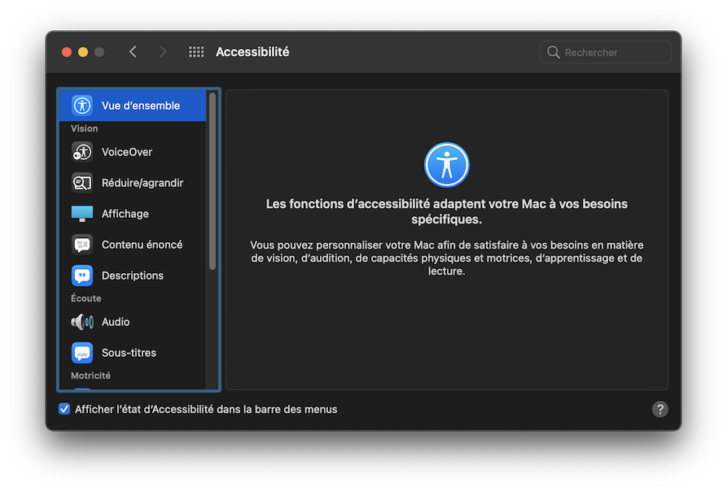

# Accessibilité &amp; Handicap

<!-- .slide: class="page-title" -->

## Sommaire

<!-- .slide: class="toc" -->

- [Agenda](#/0)
- **[Accessibilité &amp; Handicap](#/1)**
- [Standards &amp; Réglementations](#/2)
- [Web Content Accessibility Guidelines (WCAG)](#/3)
- [Mesurer &amp; Évaluer l'Accessibilité Web](#/4)

## Qu'est ce que le handicap ?

> Le handicap est la limitation des possibilités d'interaction d'un individu
> avec son environnement, menant à des difficultés psychologiques,
> intellectuelles, sociales ou physiques. Le handicap est d'abord pensé comme
> relatif à une déficience provoquant une incapacité — permanente ou non — puis
> il est redéfini relativement à une inégalité de moyens, en intégrant l'idée
> que « des interventions destinées à lever les obstacles environnementaux et
> sociaux sont nécessaires »

https://fr.wikipedia.org/wiki/Handicap

> Constitue un handicap, toute limitation d’activité ou restriction de
> participation à la vie en société subie dans son environnement par une
> personne en raison d’une altération substantielle, durable ou définitive
> d’une ou plusieurs fonctions physiques, sensorielles, mentales, cognitives ou
> psychiques, d’un polyhandicap ou d’un trouble de santé invalidant.

[Loi du 11 février 2005, art. 2](https://www.legifrance.gouv.fr/codes/article_lc/LEGIARTI000006796446/)

Notes :
Utiliser ces définitions pour ouvrir la discussion avec les participants et recentrer au besoin sur la notion de "situation de handicap" par oposition à la notion de "personne handicapée".

## Accessibilité universelle

> L’accessibilité universelle est la condition qui permet la participation de
> tous.
>
> Elle est définie comme le caractère d’un produit, procédé, service,
> information ou environnement qui, dans un but d’équité et dans une approche
> inclusive, permet à toute personne de réaliser des activités de façon
> autonome et d’obtenir des résultats équivalents.

[AlterGo.ca](https://www.altergo.ca/fr/accessibilite-universelle/quest-ce-que-laccessibilite-universelle/)

> On appelle accessibilité universelle l’accès « à tout pour tous », l’accès à
> tout bâtiment ou aménagement permettant, dans des conditions normales de
> fonctionnement, à des personnes handicapées, avec la plus grande autonomie
> possible, de circuler, d’accéder aux locaux et équipements, d’utiliser les
> équipements, de se repérer, de communiquer et de bénéficier des prestations
> en vue desquelles cet établissement ou cette installation a été conçu. Les
> conditions d’accès des personnes handicapées doivent être les mêmes que
> celles des personnes valides ou, à défaut, présenter une qualité d’usage
> équivalente.

[handicap.gouv.fr](https://handicap.gouv.fr/vivre-avec-un-handicap/acceder-se-deplacer/article/accessibilite-universelle)

## Qu'est ce que l'accessibilité web ?

> The power of the Web is in its universality. Access by everyone regardless of
> disability is an essential aspect. **Tim Berners-Lee**

L'accessibilité web, c'est l'ensemble des mesures prises (techniques, graphiques, organisationnels, …) pour qu'un site ou une application web soit utilisable par toute personne, quels que soient ses moyens et conditions d'accès.

## Les différents types de handicap

Notes : Post-it + feutre
Laisser 2min aux participants pour notez les différents handicaps auxquels ils pensent sur les post-it puis les faire coller, commenter et regrouper leur post-it avant de passer à la suite

## Les différents types de handicap

Une classification des handicaps est établie par l'OMS au travers de 5 grandes catégories :

- le handicap Moteur
- le handicap Sensoriel (visuel, auditif, …)
- le handicap Psychique (pathologies perturbant la personnalité)
- le handicap Mental (déficiences intellectuelles)
- et les maladies invalidantes.

Notes :
- https://www.who.int/classifications/international-classification-of-functioning-disability-and-health

## Le handicap en chiffres

- Personnes vivant dans le monde avec une forme de handicap chronique: [15%](https://www.who.int/news-room/fact-sheets/detail/disability-and-health)
- Personnes commençant a souffrir d'un handicap à l'age adulte: [85%](https://www.tousuniques.fr/2016/09/infographie-handicap-travail-chiffres-cles/)
- Le fauteuil roulant chez les personnes souffrant d'un handicap moteur: [5%](https://solidarites-sante.gouv.fr/IMG/pdf/1190047136_Guide_AGEFIPH.pdf)
- Personnes portant des lunettes ou des lentilles de vue: [70%](https://drees.solidarites-sante.gouv.fr/etudes-et-statistiques/publications/etudes-et-resultats/article/troubles-de-la-vision-sept-adultes-sur-dix-portent-des-lunettes)
- Personnes atteintes de daltonisme: [8%](https://fr.wikipedia.org/wiki/Daltonisme#%C3%89pid%C3%A9miologie_et_g%C3%A9n%C3%A9tique)
- Personnes souffrant d'acouphènes permanents: [5%](https://www.journee-audition.org/pdf/cp-1francais-4.pdf)
- Personnes souffrant d'autisme en France: [1%](https://fr.wikipedia.org/wiki/Autisme_en_France)
- Personnes souffrant d'illettrisme en France: [7%](http://www.anlci.gouv.fr/Illettrisme/Les-chiffres/Niveau-national)

## Les assistances techniques pour le web

<figure>
  <iframe style="display:block;margin:0 auto;" width="960" height="540" data-src="https://www.youtube.com/embed/cCHGZLmJJgQ"></iframe>
  <figcaption>
    <a href="https://www.youtube.com/watch?v=cCHGZLmJJgQ" target="_blank">https://www.youtube.com/watch?v=cCHGZLmJJgQ</a>
  </figcaption>
</figure>

## Les options des systèmes d'exploitation

- [Windows](https://www.microsoft.com/fr-fr/accessibility/windows)
- [MacOS & iOS](https://www.apple.com/accessibility/)
- [Android](https://support.google.com/accessibility/android/answer/6006564?hl=fr)

  
  

## Les navigateurs eux-même

- Configuration du navigateur ([Firefox](https://support.mozilla.org/fr/kb/fonctionnalites-accessibilite-adapter-firefox-tous-utilisateurs#w_raccourcis-souris), [Chrome](https://sites.google.com/a/chromium.org/dev/user-experience/low-vision-support))
  - taille du texte
  - couleur du texte et de l'arrière-plan
  - Mode sombre
  - Accès au clavier
- Zoom navigateur
  - Niveau par défaut
  - Texte seul
- Extensions
  - Stylus ([Firefox](https://addons.mozilla.org/fr/firefox/addon/styl-us/), [Chrome](https://chrome.google.com/webstore/detail/stylus/clngdbkpkpeebahjckkjfobafhncgmne)), Stylish([Firefox](https://addons.mozilla.org/fr/firefox/addon/stylish/), [Chrome](https://chrome.google.com/webstore/detail/stylish-custom-themes-for/fjnbnpbmkenffdnngjfgmeleoegfcffe))
  - Et bien d'autres ([Firefox](), [Chrome](https://chrome.google.com/webstore/category/collection/accessibility))

Notes :
- https://www.google.com/accessibility/products-features/

## Loupes et lecteurs d'écran

- Loupes d'écran
  - [ZoomText](https://www.freedomscientific.com/products/software/zoomtext/) (Windows)
  - [SuperNova](https://yourdolphin.com/en-gb/products/individuals/families/supernova)
- [Lecteurs d'écran](https://en.wikipedia.org/wiki/List_of_screen_readers)
  - [Jaws](https://www.freedomscientific.com/products/software/jaws/) (Windows)
  - [NVDA](https://www.nvaccess.org/about-nvda/) (Windows)
  - [Dolphin](https://yourdolphin.com/en-gb/products/individuals/screen-reader) (Windows)
  - [Narrateur](https://support.microsoft.com/fr-fr/windows/guide-complet-sur-le-narrateur-e4397a0d-ef4f-b386-d8ae-c172f109bdb1) (Windows)
  - [Orca](https://help.gnome.org/users/orca/stable/) (Linux)
  - [VoiceOver](https://www.apple.com/fr/accessibility/vision/) (macos, ios)
  - [TalkBack](https://support.google.com/accessibility/android/answer/6283677?hl=en) (Android)
- Plages braille

Notes :
Faire une démonstration de Narrateur ou de VoiceOver qui sont présent par défaut sur Windows ou MacOS.

## Tendance d'usage

Notes :
- SAToGo https://www.satogo.com/fr/
- WebAIM survey: https://webaim.org/projects/screenreadersurvey8/

## Combinaisons d'usage courantes

<figure>
<table style="margin:0 auto">
	<tbody><tr><th scope="col">OS</th><th scope="col">Navigateur</th><th scope="col">Lecteur d'écran</th><th scope="col">% d'utilisateur</th></tr>
	<tr><td>Windows</td><td>Chrome</td><td>JAWS</td><td>21.4%</td></tr>
	<tr><td>Windows</td><td>Firefox</td><td>NVDA</td><td>19.6%</td></tr>
	<tr><td>Windows</td><td>Chrome</td><td>NVDA</td><td>18.0%</td></tr>
	<tr><td>Windows</td><td>Internet Explorer</td><td>JAWS</td><td>11.5%</td></tr>
	<tr><td>ios (&amp; macos)</td><td>Safari</td><td>VoiceOver</td><td>9.1%</td></tr>
	<tr><td>Windows</td><td>Firefox</td><td>JAWS</td><td>5.9%</td></tr>
	<tr><td>ios</td><td>Chrome</td><td>VoiceOver</td><td>3.0%</td></tr>
	<tr><td>Windows</td><td>Internet Explorer</td><td>NVDA</td><td>1.2%</td></tr>
</tbody></table>

<figcaption style="margin-top:.5em"><a href="https://webaim.org/projects/screenreadersurvey8/" lang="en" hreflang="en">WebAIM survey #8 (2019)</a></figcaption>
</figure>

Notes :
Compatibilité ARIA: https://www.powermapper.com/tests/screen-readers/

<!-- .slide: class="page-questions" -->
