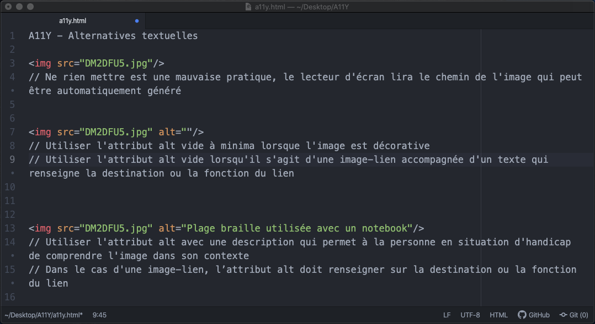
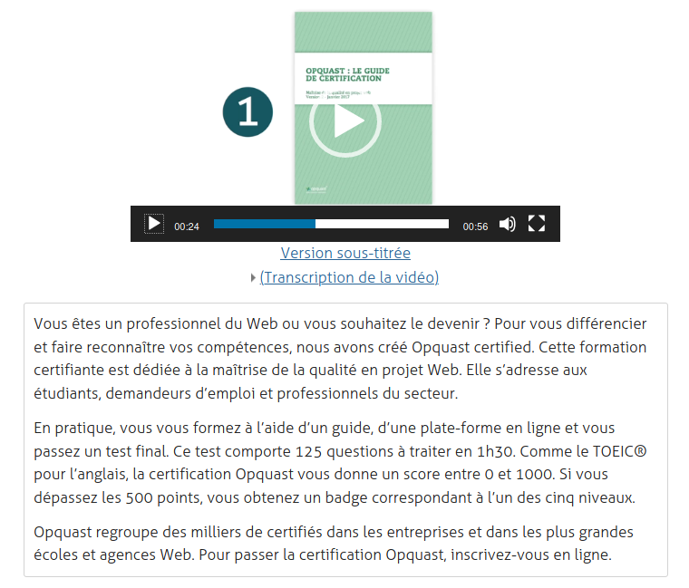
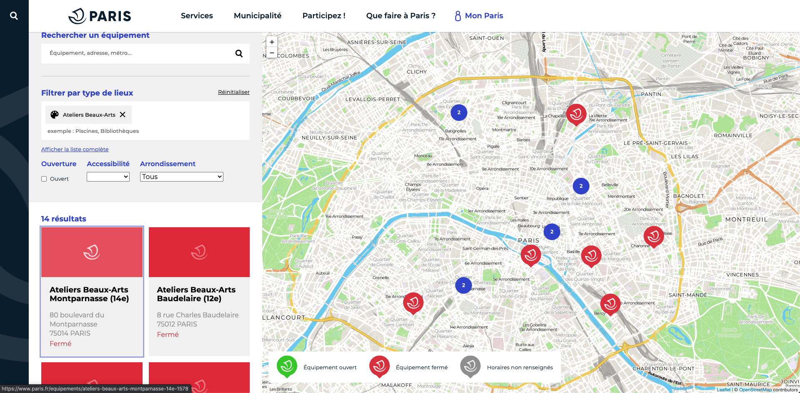
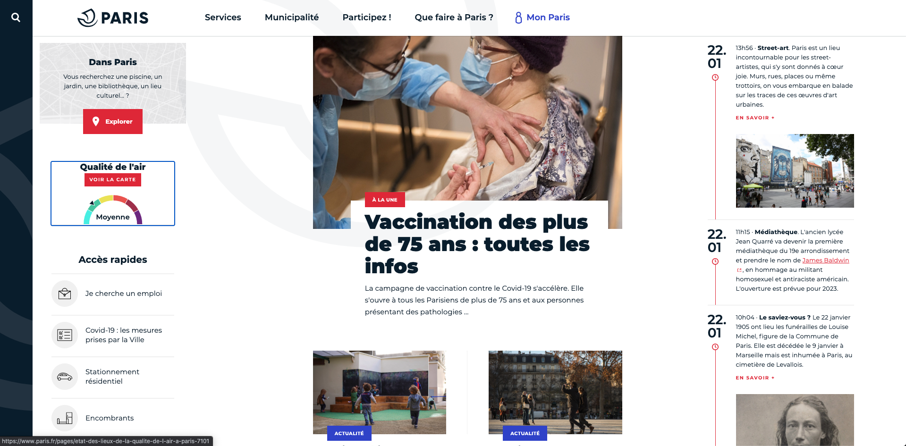
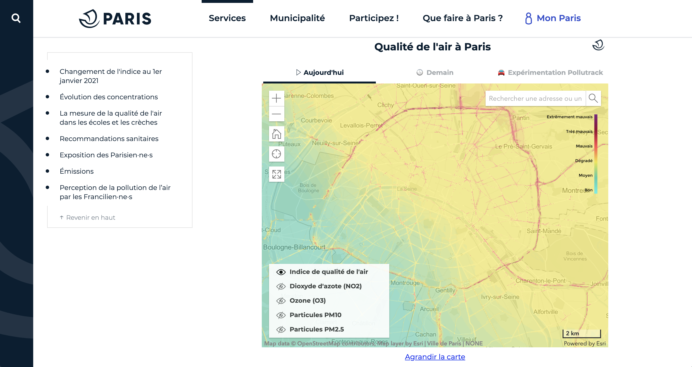
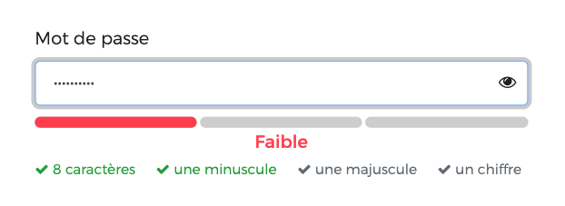
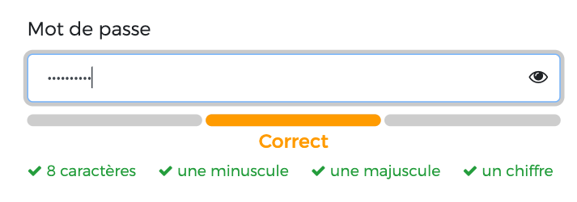

# WCAG

<!-- .slide: class="page-title" -->

## Sommaire

<!-- .slide: class="toc" -->

- [Agenda](#/0)
- [Accessibilité &amp; Handicap](#/1)
- [Standards &amp; Réglementations](#/2)
- **[Web Content Accessibility Guidelines (WCAG)](#/3)**
- [Mesurer &amp; Évaluer l'Accessibilité Web](#/4)
- [Mise en œuvre de l'Accessibilité Web](#/5)
- [Ce qu'il faut retenir](#/6)

## Pourquoi WCAG

<blockquote lang="en">
Web Content Accessibility Guidelines (WCAG) 2.1 covers a wide range of
recommendations for making Web content more accessible. Following these
guidelines will make content more accessible to a wider range of people with
disabilities, including accommodations for blindness and low vision, deafness
and hearing loss, limited movement, speech disabilities, photosensitivity,
and combinations of these, and some accommodation for learning disabilities
and cognitive limitations; but will not address every user need for people
with these disabilities. These guidelines address accessibility of web
content on desktops, laptops, tablets, and mobile devices. Following these
guidelines will also often make Web content more usable to users in general.
</blockquote>

[Introduction aux WCAG](https://www.w3.org/TR/WCAG/#intro)

<small style="display:block; columns:2; font-size:.6em; line-height:1.4">les <i lang="en">Web Content Accessibility Guidelines (WCAG) 2.1</i> couvrent un large spectre de recommandations pour rendre les contenus web plus accessibles. Suivre ces principes rendra les contenus plus accessibles à un ensemble plus important de personnes en situation de handicap, ce qui inclut des aménagements pour la cécité ou la déficience visuelle, la surdité et la perte d’audition, les contraintes motrices, les difficultés d’élocution, la photosensibilité et la combinaison de tous ces états ; elle inclut également des dispositions pour les problèmes d’apprentissage ou de cognition. Cependant, elle ne répond pas à l’exhaustivité des besoins des personnes en situation de handicap. Ces principes couvrent l’accessibilité des contenus web sur les ordinateurs de bureau, les ordinateurs portables, les tablettes et les appareils mobiles. Suivre ces principes rendra généralement les contenus web plus faciles à utiliser pour tous les utilisateurs.</small>

## La spécification WCAG

<i lang="en">Web Content Accessibility Guidelines</i> 
**Recommandation pour l'Accessibilité des Contenus Web**

- 1999: [WCAG 1.0](https://www.w3.org/TR/WCAG10/)
- 2008: [WCAG 2.0](https://www.w3.org/TR/WCAG20/) ([FR](https://www.w3.org/Translations/WCAG20-fr/))
- 2018: [WCAG 2.1](https://www.w3.org/TR/WCAG21/)
- 2021 (?): [WCAG 2.2](https://w3c.github.io/wcag/guidelines/22/)

La spécification est accompagnée de plusieurs documents d'accompagnement:

- [Comprendre WCAG 2.1](https://www.w3.org/WAI/WCAG21/Understanding/)
- [Techniques de mise en œuvre pour WCAG 2.1](https://www.w3.org/WAI/WCAG21/Techniques/)
- [Aide mémoire WCAG 2.1](https://www.w3.org/WAI/WCAG21/quickref/)

A son niveau le plus basique, la spécification WCAG est organisée comme un jeu de poupées russes.

## Les 4 principes fondamentaux

WCAG s'articule autour de 4 principes fondamentaux qui disent qu'un contenu web doit toujours être:

1. **Perceptible** (<i lang="en">Perceivable</i>) 
  <small>Les informations et les éléments d'interface doivent être présentés aux utilisateurs de manière à ce qu'ils puissent les percevoir. (Ils doivent être perceptibles par au moins un de leur sens)</small>
2. **Utilisable** (<i lang="en">Operable</i>) 
  <small>Les éléments d'interface et de navigation doivent être utilisables par les utilisateurs. (Les interfaces ne doivent pas requérir une interaction que l'utilisateur ne peut pas réaliser)</small>
3. **Compréhensible** (<i lang="en">understandable</i>) 
  <small>Les informations et les actions à réaliser doivent être compréhensible. (Les utilisateur ne doive pas être confronté à des information ou des interactions qui dépassent leur compréhension)</small>
4. **Robuste** (<i lang="en">Robust</i>) 
  <small>Le contenu doit être suffisamment robuste pour être interprété de manière fiable par une large variété d'agents utilisateurs, y compris les technologies d'assistance. (Les contenus doivent rester accessibles même si les agents utilisateurs évoluent)</small>

## Les 13 recommandations (1/4)

Les 4 principes précédents se subdivisent en 13 recommandations:

_1. Perceptible_

**1.1 Alternatives Textuelles** 
  <small>Proposer des équivalents textuels à tout contenu non textuel qui pourra alors être présenté sous d'autres formes selon les besoins de l'utilisateur : grands caractères, braille, synthèse vocale, symboles ou langage simplifié.</small>

  
  

**1.2 Médias temporels** 
  <small>Proposer des versions de remplacement aux médias temporels.</small>
  

**1.3 Adaptable** 
  <small>Créer un contenu qui puisse être présenté de différentes manières sans perte d'information ni de structure (par exemple avec une mise en page simplifiée).</small>

**1.4 Distinguable** 
  <small>Faciliter la perception visuelle et auditive du contenu par l'utilisateur, notamment en séparant le premier plan de l'arrière-plan.</small>

Notes :
- 1.1 https://www.w3.org/WAI/WCAG21/quickref/#text-alternatives
- 1.2 https://www.w3.org/WAI/WCAG21/quickref/#time-based-media
- 1.3 https://www.w3.org/WAI/WCAG21/quickref/#adaptable
- 1.4 https://www.w3.org/WAI/WCAG21/quickref/#distinguishable

## Les 13 recommandations (2/4)

_2. Utilisable_

**2.1 Accessibilité au clavier** 
  <small>Rendre toutes les fonctionnalités accessibles au clavier.</small>
  

**2.2 Délai suffisant** 
  <small>Laisser à l'utilisateur suffisamment de temps pour lire et utiliser le contenu.</small>

**2.3 Réaction physique** 
  <small>Ne pas concevoir de contenu susceptible de provoquer des crises ou réactions physiques.</small>

**2.4 Navigable** 
  <small>Fournir à l'utilisateur des éléments d'orientation pour naviguer, trouver le contenu et se situer dans le site.</small>
  

**2.5 Modalité d'interaction** 
  <small>Simplifier la possibilité pour les utilisateurs d'utiliser les fonctionnalités via un système d'interaction autre que le clavier.</small>

Notes :
- 2.1 https://www.w3.org/WAI/WCAG21/quickref/#keyboard-accessible
- 2.2 https://www.w3.org/WAI/WCAG21/quickref/#enough-time
- 2.3 https://www.w3.org/WAI/WCAG21/quickref/#seizures-and-physical-reactions
- 2.4 https://www.w3.org/WAI/WCAG21/quickref/#navigable
- 2.5 https://www.w3.org/WAI/WCAG21/quickref/#input-modalities

## Les 13 recommandations (3/4)

_3. Compréhensible_

**3.1 Lisible** 
  <small>Rendre le contenu textuel lisible et compréhensible.</small>

**3.2 Prévisible** 
  <small>Faire en sorte que les pages apparaissent et fonctionnent de manière prévisible.</small>

  

    
    
  

**3.3 Assistance à la saisie** 
  <small>Aider l'utilisateur à éviter et à corriger les erreurs de saisie.</small>

  

    
    
  

Notes :
- 3.1 https://www.w3.org/WAI/WCAG21/quickref/#readable
- 3.2 https://www.w3.org/WAI/WCAG21/quickref/#predictable
- 3.3 https://www.w3.org/WAI/WCAG21/quickref/#input-assistance

## Les 13 recommandations (4/4)

_4. Robuste_

**4.1 Compatible** 
  <small>Optimiser la compatibilité avec les agents utilisateurs actuels et futurs, y compris les technologies d'assistance.</small>

Notes :
- 4.1 https://www.w3.org/WAI/WCAG21/quickref/#input-assistance

Penser à rappeler que cela concerne aussi bien HTML que PDF

## Les critères de succès

Toutes ces recommandations se subdivisent elles-mêmes en [*78 critères de succès*](https://www.w3.org/WAI/WCAG21/quickref/) que l'on va chercher à atteindre.

Ces critères de succès sont classés selon trois niveaux de conformité :

- **Niveau A** : Les plus simple à mettre en œuvre ou les plus critiques pour les utilisateurs.
- **Niveau AA** : Ceux qui sont plus exigeants en termes de mise en oeuvre ou qui ont un impact plus spécifique pour les utilisateurs.
- **Niveau AAA** : Les critères requis pour adresser des besoins très spécifiques ou avec un impact de mise en œuvre tel qu'ils requièrent une expertise particulière.

Un niveau de conformité est considéré comme atteint quand tous les critères de succès applicables du niveau sont atteint ainsi que ceux du niveau précédent.

## Les critères de succès

<ul style="font-size:0.75em;">
  <li><em>Niveau A</em>
    <ul style="font-size:0.55em; columns: 4;">
      <li><a href="https://www.w3.org/WAI/WCAG21/Understanding/non-text-content.html" hreflang="en" lang="en">1.1.1 Non-text Content</a></li>
      <li><a href="https://www.w3.org/WAI/WCAG21/Understanding/audio-only-and-video-only-prerecorded.html" hreflang="en" lang="en">1.2.1 Audio-only and Video-only (Prerecorded)</a></li>
      <li><a href="https://www.w3.org/WAI/WCAG21/Understanding/captions-prerecorded.html" hreflang="en" lang="en">1.2.2 Captions (Prerecorded)</a></li>
      <li><a href="https://www.w3.org/WAI/WCAG21/Understanding/audio-description-or-media-alternative-prerecorded.html" hreflang="en" lang="en">1.2.3 Audio Description or Media Alternative (Prerecorded)</a></li>
      <li><a href="https://www.w3.org/WAI/WCAG21/Understanding/info-and-relationships.html" hreflang="en" lang="en">1.3.1 Info and Relationships</a></li>
      <li><a href="https://www.w3.org/WAI/WCAG21/Understanding/meaningful-sequence.html" hreflang="en" lang="en">1.3.2 Meaningful Sequence</a></li>
      <li><a href="https://www.w3.org/WAI/WCAG21/Understanding/sensory-characteristics.html" hreflang="en" lang="en">1.3.3 Sensory Characteristics</a></li>
      <li><a href="https://www.w3.org/WAI/WCAG21/Understanding/use-of-color.html" hreflang="en" lang="en">1.4.1 Use of Color</a></li>
      <li><a href="https://www.w3.org/WAI/WCAG21/Understanding/audio-control.html" hreflang="en" lang="en">1.4.2 Audio Control</a></li>
      <li><a href="https://www.w3.org/WAI/WCAG21/Understanding/keyboard.html" hreflang="en" lang="en">2.1.1 Keyboard</a></li>
      <li><a href="https://www.w3.org/WAI/WCAG21/Understanding/no-keyboard-trap.html" hreflang="en" lang="en">2.1.2 No Keyboard Trap</a></li>
      <li><a href="https://www.w3.org/WAI/WCAG21/Understanding/character-key-shortcuts.html" hreflang="en" lang="en">2.1.4 Character Key Shortcuts</a></li>
      <li><a href="https://www.w3.org/WAI/WCAG21/Understanding/timing-adjustable.html" hreflang="en" lang="en">2.2.1 Timing Adjustable</a></li>
      <li><a href="https://www.w3.org/WAI/WCAG21/Understanding/pause-stop-hide.html" hreflang="en" lang="en">2.2.2 Pause, Stop, Hide</a></li>
      <li><a href="https://www.w3.org/WAI/WCAG21/Understanding/three-flashes-or-below-threshold.html" hreflang="en" lang="en">2.3.1 Three Flashes or Below Threshold</a></li>
      <li><a href="https://www.w3.org/WAI/WCAG21/Understanding/bypass-blocks.html" hreflang="en" lang="en">2.4.1 Bypass Blocks</a></li>
      <li><a href="https://www.w3.org/WAI/WCAG21/Understanding/page-titled.html" hreflang="en" lang="en">2.4.2 Page Titled</a></li>
      <li><a href="https://www.w3.org/WAI/WCAG21/Understanding/focus-order.html" hreflang="en" lang="en">2.4.3 Focus Order</a></li>
      <li><a href="https://www.w3.org/WAI/WCAG21/Understanding/link-purpose-in-context.html" hreflang="en" lang="en">2.4.4 Link Purpose (In Context)</a></li>
      <li><a href="https://www.w3.org/WAI/WCAG21/Understanding/pointer-gestures.html" hreflang="en" lang="en">2.5.1 Pointer Gestures</a></li>
      <li><a href="https://www.w3.org/WAI/WCAG21/Understanding/pointer-cancellation.html" hreflang="en" lang="en">2.5.2 Pointer Cancellation</a></li>
      <li><a href="https://www.w3.org/WAI/WCAG21/Understanding/label-in-name.html" hreflang="en" lang="en">2.5.3 Label in Name</a></li>
      <li><a href="https://www.w3.org/WAI/WCAG21/Understanding/motion-actuation.html" hreflang="en" lang="en">2.5.4 Motion Actuation</a></li>
      <li><a href="https://www.w3.org/WAI/WCAG21/Understanding/language-of-page.html" hreflang="en" lang="en">3.1.1 Language of Page</a></li>
      <li><a href="https://www.w3.org/WAI/WCAG21/Understanding/on-focus.html" hreflang="en" lang="en">3.2.1 On Focus</a></li>
      <li><a href="https://www.w3.org/WAI/WCAG21/Understanding/on-input.html" hreflang="en" lang="en">3.2.2 On Input</a></li>
      <li><a href="https://www.w3.org/WAI/WCAG21/Understanding/error-identification.html" hreflang="en" lang="en">3.3.1 Error Identification</a></li>
      <li><a href="https://www.w3.org/WAI/WCAG21/Understanding/labels-or-instructions.html" hreflang="en" lang="en">3.3.2 Labels or Instructions</a></li>
      <li><a href="https://www.w3.org/WAI/WCAG21/Understanding/parsing.html" hreflang="en" lang="en">4.1.1 Parsing</a></li>
      <li><a href="https://www.w3.org/WAI/WCAG21/Understanding/name-role-value.html" hreflang="en" lang="en">4.1.2 Name, Role, Value</a></li>
    </ul>
  </li>
  <li><em>Niveau AA</em>
    <ul style="font-size:0.55em; columns: 4;">
      <li><a href="https://www.w3.org/WAI/WCAG21/Understanding/captions-live.html" hreflang="en" lang="en">1.2.4 Captions (Live)</a></li>
      <li><a href="https://www.w3.org/WAI/WCAG21/Understanding/audio-description-prerecorded.html" hreflang="en" lang="en">1.2.5 Audio Description (Prerecorded)</a></li>
      <li><a href="https://www.w3.org/WAI/WCAG21/Understanding/orientation.html" hreflang="en" lang="en">1.3.4 Orientation</a></li>
      <li><a href="https://www.w3.org/WAI/WCAG21/Understanding/identify-input-purpose.html" hreflang="en" lang="en">1.3.5 Identify Input Purpose</a></li>
      <li><a href="https://www.w3.org/WAI/WCAG21/Understanding/contrast-minimum.html" hreflang="en" lang="en">1.4.3 Contrast (Minimum)</a></li>
      <li><a href="https://www.w3.org/WAI/WCAG21/Understanding/resize-text.html" hreflang="en" lang="en">1.4.4 Resize text</a></li>
      <li><a href="https://www.w3.org/WAI/WCAG21/Understanding/images-of-text.html" hreflang="en" lang="en">1.4.5 Images of Text</a></li>
      <li><a href="https://www.w3.org/WAI/WCAG21/Understanding/reflow.html" hreflang="en" lang="en">1.4.10 Reflow</a></li>
      <li><a href="https://www.w3.org/WAI/WCAG21/Understanding/non-text-contrast.html" hreflang="en" lang="en">1.4.11 Non-text Contrast</a></li>
      <li><a href="https://www.w3.org/WAI/WCAG21/Understanding/text-spacing.html" hreflang="en" lang="en">1.4.12 Text Spacing</a></li>
      <li><a href="https://www.w3.org/WAI/WCAG21/Understanding/content-on-hover-or-focus.html" hreflang="en" lang="en">1.4.13 Content on Hover or Focus</a></li>
      <li><a href="https://www.w3.org/WAI/WCAG21/Understanding/multiple-ways.html" hreflang="en" lang="en">2.4.5 Multiple Ways</a></li>
      <li><a href="https://www.w3.org/WAI/WCAG21/Understanding/headings-and-labels.html" hreflang="en" lang="en">2.4.6 Headings and Labels</a></li>
      <li><a href="https://www.w3.org/WAI/WCAG21/Understanding/focus-visible.html" hreflang="en" lang="en">2.4.7 Focus Visible</a></li>
      <li><a href="https://www.w3.org/WAI/WCAG21/Understanding/language-of-parts.html" hreflang="en" lang="en">3.1.2 Language of Parts</a></li>
      <li><a href="https://www.w3.org/WAI/WCAG21/Understanding/consistent-navigation.html" hreflang="en" lang="en">3.2.3 Consistent Navigation</a></li>
      <li><a href="https://www.w3.org/WAI/WCAG21/Understanding/consistent-identification.html" hreflang="en" lang="en">3.2.4 Consistent Identification</a></li>
      <li><a href="https://www.w3.org/WAI/WCAG21/Understanding/error-suggestion.html" hreflang="en" lang="en">3.3.3 Error Suggestion</a></li>
      <li><a href="https://www.w3.org/WAI/WCAG21/Understanding/error-prevention-legal-financial-data.html" hreflang="en" lang="en">3.3.4 Error Prevention (Legal, Financial, Data)</a></li>
      <li><a href="https://www.w3.org/WAI/WCAG21/Understanding/status-messages.html" hreflang="en" lang="en">4.1.3 Status Messages</a></li>
    </ul>
  </li>
  <li><em>Niveau AAA</em>
    <ul style="font-size:0.55em; columns: 4;">
      <li><a href="https://www.w3.org/WAI/WCAG21/Understanding/sign-language-prerecorded.html" hreflang="en" lang="en">1.2.6 Sign Language (Prerecorded)</a></li>
      <li><a href="https://www.w3.org/WAI/WCAG21/Understanding/extended-audio-description-prerecorded.html" hreflang="en" lang="en">1.2.7 Extended Audio Description (Prerecorded)</a></li>
      <li><a href="https://www.w3.org/WAI/WCAG21/Understanding/media-alternative-prerecorded.html" hreflang="en" lang="en">1.2.8 Media Alternative (Prerecorded)</a></li>
      <li><a href="https://www.w3.org/WAI/WCAG21/Understanding/audio-only-live.html" hreflang="en" lang="en">1.2.9 Audio-only (Live)</a></li>
      <li><a href="https://www.w3.org/WAI/WCAG21/Understanding/identify-purpose.html" hreflang="en" lang="en">1.3.6 Identify Purpose</a></li>
      <li><a href="https://www.w3.org/WAI/WCAG21/Understanding/contrast-enhanced.html" hreflang="en" lang="en">1.4.6 Contrast (Enhanced)</a></li>
      <li><a href="https://www.w3.org/WAI/WCAG21/Understanding/low-or-no-background-audio.html" hreflang="en" lang="en">1.4.7 Low or No Background Audio</a></li>
      <li><a href="https://www.w3.org/WAI/WCAG21/Understanding/visual-presentation.html" hreflang="en" lang="en">1.4.8 Visual Presentation</a></li>
      <li><a href="https://www.w3.org/WAI/WCAG21/Understanding/images-of-text-no-exception.html" hreflang="en" lang="en">1.4.9 Images of Text (No Exception)</a></li>
      <li><a href="https://www.w3.org/WAI/WCAG21/Understanding/keyboard-no-exception.html" hreflang="en" lang="en">2.1.3 Keyboard (No Exception)</a></li>
      <li><a href="https://www.w3.org/WAI/WCAG21/Understanding/no-timing.html" hreflang="en" lang="en">2.2.3 No Timing</a></li>
      <li><a href="https://www.w3.org/WAI/WCAG21/Understanding/interruptions.html" hreflang="en" lang="en">2.2.4 Interruptions</a></li>
      <li><a href="https://www.w3.org/WAI/WCAG21/Understanding/re-authenticating.html" hreflang="en" lang="en">2.2.5 Re-authenticating</a></li>
      <li><a href="https://www.w3.org/WAI/WCAG21/Understanding/timeouts.html" hreflang="en" lang="en">2.2.6 Timeouts</a></li>
      <li><a href="https://www.w3.org/WAI/WCAG21/Understanding/three-flashes.html" hreflang="en" lang="en">2.3.2 Three Flashes</a></li>
      <li><a href="https://www.w3.org/WAI/WCAG21/Understanding/animation-from-interactions.html" hreflang="en" lang="en">2.3.3 Animation from Interactions</a></li>
      <li><a href="https://www.w3.org/WAI/WCAG21/Understanding/location.html" hreflang="en" lang="en">2.4.8 Location</a></li>
      <li><a href="https://www.w3.org/WAI/WCAG21/Understanding/link-purpose-link-only.html" hreflang="en" lang="en">2.4.9 Link Purpose (Link Only)</a></li>
      <li><a href="https://www.w3.org/WAI/WCAG21/Understanding/section-headings.html" hreflang="en" lang="en">2.4.10 Section Headings</a></li>
      <li><a href="https://www.w3.org/WAI/WCAG21/Understanding/target-size.html" hreflang="en" lang="en">2.5.5 Target Size</a></li>
      <li><a href="https://www.w3.org/WAI/WCAG21/Understanding/concurrent-input-mechanisms.html" hreflang="en" lang="en">2.5.6 Concurrent Input Mechanisms</a></li>
      <li><a href="https://www.w3.org/WAI/WCAG21/Understanding/unusual-words.html" hreflang="en" lang="en">3.1.3 Unusual Words</a></li>
      <li><a href="https://www.w3.org/WAI/WCAG21/Understanding/abbreviations.html" hreflang="en" lang="en">3.1.4 Abbreviations</a></li>
      <li><a href="https://www.w3.org/WAI/WCAG21/Understanding/reading-level.html" hreflang="en" lang="en">3.1.5 Reading Level</a></li>
      <li><a href="https://www.w3.org/WAI/WCAG21/Understanding/pronunciation.html" hreflang="en" lang="en">3.1.6 Pronunciation</a></li>
      <li><a href="https://www.w3.org/WAI/WCAG21/Understanding/change-on-request.html" hreflang="en" lang="en">3.2.5 Change on Request</a></li>
      <li><a href="https://www.w3.org/WAI/WCAG21/Understanding/help.html" hreflang="en" lang="en">3.3.5 Help</a></li>
      <li><a href="https://www.w3.org/WAI/WCAG21/Understanding/error-prevention-all.html" hreflang="en" lang="en">3.3.6 Error Prevention (All)</a></li>
    </ul>
  </li>
</ul>

## Les techniques de mise en œuvre

Enfin, tout les critères de succès sont accompagnés de techniques de mise en œuvre :

- Les _techniques suffisantes_
- Les _techniques recommandées_
- Les [_cas d'échec_](https://www.w3.org/WAI/WCAG21/Techniques/#failures)

Ces techniques sont détaillées dans des fiches individuelles qui précisent à quelles technologies elles sont associées, pourquoi elles sont nécessaires et que faire pour les mettre en œuvre.

_La principale difficulté c'est de trouver la bonne technique adaptée au contexte de mise en œuvre_

## A retenir : Les contenus alternatifs

Tout les contenus qui ne sont pas du texte doivent être doublés avec une alternative textuelle :
- Les images (celles qui portent du sens comme les graphiques, ou qui contiennent du texte)
- Les contenus vidéo (sous-titre, audio-description, transcription…)
- Les contenus audio (sous-titre, audio-description, transcription…)
- Les animations
- Les éléments interactifs programmatiques (tout ce qui est crée par JS dans un canvas)

Critères de succès: [1.1.1](https://www.w3.org/WAI/WCAG21/Understanding/non-text-content.html), [1.2.1](https://www.w3.org/WAI/WCAG21/Understanding/audio-only-and-video-only-prerecorded.html), [1.2.2](https://www.w3.org/WAI/WCAG21/Understanding/captions-prerecorded.html) , [1.2.3](https://www.w3.org/WAI/WCAG21/Understanding/audio-description-or-media-alternative-prerecorded.html), [1.2.4](https://www.w3.org/WAI/WCAG21/Understanding/captions-live.html), [1.2.5](https://www.w3.org/WAI/WCAG21/Understanding/audio-description-prerecorded.html), [1.2.6](https://www.w3.org/WAI/WCAG21/Understanding/sign-language-prerecorded.html), [1.2.7](https://www.w3.org/WAI/WCAG21/Understanding/extended-audio-description-prerecorded.html), [1.2.8](https://www.w3.org/WAI/WCAG21/Understanding/media-alternative-prerecorded.html), [1.2.9](https://www.w3.org/WAI/WCAG21/Understanding/audio-only-live.html)

## A retenir : Les contraintes de design

Le design à un rôle clé à jouer dans la gestion de l'accessibilité

- Les couleurs (contraste et usage pour passer de l'information…)
- Le texte (taille du texte, capacité à zoomer le texte…)
- Les animations doivent être discrètes ou sous le contrôle des utilisateurs
- Les interactions des utilisateurs doivent être matérialisées
- La séparation fond/forme
  - Le design ne doit pas dépendre d'un appareil en particulier (Responsive Web Design)
  - Un contenu peut être affiché avec un style différent ou sans style
  - Le design ne doit pas altérer l'ordre des éléments affichés
  - Le design ne doit pas être la seule source d'une information

Critères de succès: [1.3.2](https://www.w3.org/WAI/WCAG21/Understanding/meaningful-sequence.html), [1.3.3](https://www.w3.org/WAI/WCAG21/Understanding/sensory-characteristics.html), [1.4.1](https://www.w3.org/WAI/WCAG21/Understanding/use-of-color.html), [1.4.3](https://www.w3.org/WAI/WCAG21/Understanding/contrast-minimum.html), [1.4.4](https://www.w3.org/WAI/WCAG21/Understanding/resize-text.html), [1.4.5](https://www.w3.org/WAI/WCAG21/Understanding/images-of-text.html), [1.4.6](https://www.w3.org/WAI/WCAG21/Understanding/contrast-enhanced.html), [1.4.8](https://www.w3.org/WAI/WCAG21/Understanding/visual-presentation.html), [1.4.9](https://www.w3.org/WAI/WCAG21/Understanding/images-of-text-no-exception.html), [1.4.10](https://www.w3.org/WAI/WCAG21/Understanding/reflow.html), [1.4.11](https://www.w3.org/WAI/WCAG21/Understanding/non-text-contrast.html), [1.4.12](https://www.w3.org/WAI/WCAG21/Understanding/text-spacing.html), [2.3.1](https://www.w3.org/WAI/WCAG21/Understanding/three-flashes-or-below-threshold.html), [2.3.2](https://www.w3.org/WAI/WCAG21/Understanding/three-flashes.html), [2.3.3](https://www.w3.org/WAI/WCAG21/Understanding/animation-from-interactions.html), [2.4.3](https://www.w3.org/WAI/WCAG21/Understanding/focus-order.html), [2.4.7](https://www.w3.org/WAI/WCAG21/Understanding/focus-visible.html), [2.5.3](https://www.w3.org/WAI/WCAG21/Understanding/label-in-name.html), [2.5.4](https://www.w3.org/WAI/WCAG21/Understanding/motion-actuation.html), [2.5.5](https://www.w3.org/WAI/WCAG21/Understanding/target-size.html)

Notes :
Ça vaut le coup de mettre l'emphase sur 1.4.8 (AAA) pour montrer ce que représente une contrainte de design forte.

## A retenir : HTML

La bonne utilisation de HTML, avec toute sa sémantique et en se reposant sur les mécanismes natifs qui y sont associés est le fondement d'une bonne accessibilité. En particulier :

- Les liens
- Les titres
- Les sections
- Les formulaires
- Les tables de données

Critères de succès: [1.3.1](https://www.w3.org/WAI/WCAG21/Understanding/info-and-relationships.html), [1.3.2](https://www.w3.org/WAI/WCAG21/Understanding/meaningful-sequence.html), [2.4.1](https://www.w3.org/WAI/WCAG21/Understanding/bypass-blocks.html), [2.4.2](https://www.w3.org/WAI/WCAG21/Understanding/page-titled.html), [2.4.3](https://www.w3.org/WAI/WCAG21/Understanding/focus-order.html), [2.4.6](https://www.w3.org/WAI/WCAG21/Understanding/headings-and-labels.html), [2.4.8](https://www.w3.org/WAI/WCAG21/Understanding/location.html), [2.4.10](https://www.w3.org/WAI/WCAG21/Understanding/section-headings.html), [3.1.1](https://www.w3.org/WAI/WCAG21/Understanding/language-of-page.html), [3.1.2](https://www.w3.org/WAI/WCAG21/Understanding/language-of-parts.html), [3.1.4](https://www.w3.org/WAI/WCAG21/Understanding/abbreviations.html#techniques), [3.2.3](https://www.w3.org/WAI/WCAG21/Understanding/consistent-navigation.html), [3.3.2](https://www.w3.org/WAI/WCAG21/Understanding/labels-or-instructions.html), [4.1.1](https://www.w3.org/WAI/WCAG21/Understanding/parsing.html), [4.1.2](https://www.w3.org/WAI/WCAG21/Understanding/name-role-value.html), [4.1.3](https://www.w3.org/WAI/WCAG21/Understanding/status-messages.html)

Notes :
Penser à évoquer la question de la linéarisation des contenus

## A retenir : L'usage du clavier

La possibilité d'interagir au clavier avec un contenu web est un des fondamentaux de l'accessibilité web. Faites toujours attention aux points suivants :

- Pas d'interférence avec l'usage de la touche tabulation
- Le focus est toujours matérialisé dans le viewport
- Tous les éléments d'interaction peuvent recevoir le focus
- L'ordre de tabulation (et de focus) est toujours prévisible

Critères de succès: [1.4.13](https://www.w3.org/WAI/WCAG21/Understanding/content-on-hover-or-focus.html), [2.1.1](https://www.w3.org/WAI/WCAG21/Understanding/keyboard.html), [2.1.2](https://www.w3.org/WAI/WCAG21/Understanding/no-keyboard-trap.html), [2.1.3](https://www.w3.org/WAI/WCAG21/Understanding/keyboard-no-exception.html), [2.1.4](https://www.w3.org/WAI/WCAG21/Understanding/character-key-shortcuts.html), [2.4.3](https://www.w3.org/WAI/WCAG21/Understanding/focus-order.html), [2.4.7](https://www.w3.org/WAI/WCAG21/Understanding/focus-visible.html), [3.2.1](https://www.w3.org/WAI/WCAG21/Understanding/on-focus.html), [3.2.2](https://www.w3.org/WAI/WCAG21/Understanding/on-input.html)

<!-- .slide: class="page-questions" -->
