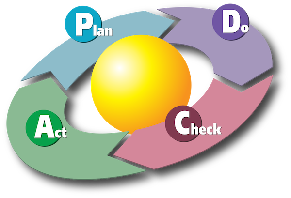
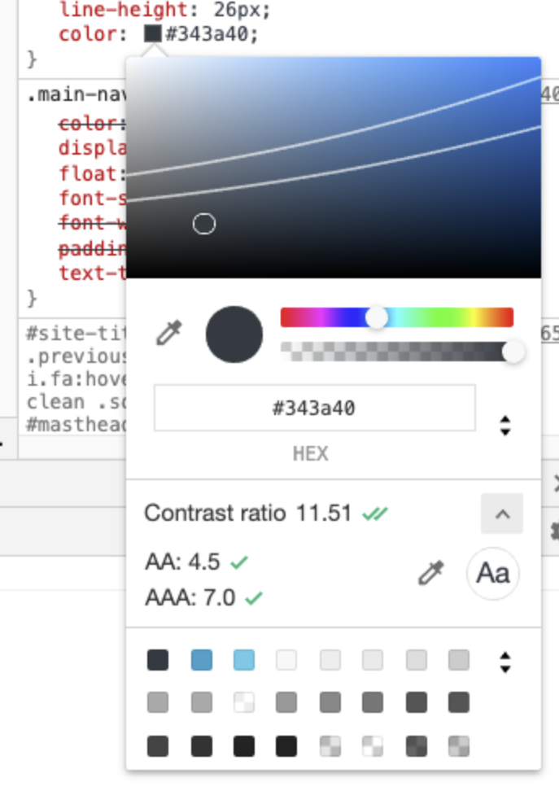

# Mise en œuvre

<!-- .slide: class="page-title" -->


## Sommaire

<!-- .slide: id="master-toc" class="toc" -->

- [Agenda](#/0)
- [Accessibilité &amp; Handicap](#/1)
- [Standards &amp; Réglementations](#/2)
- [Web Content Accessibility Guidelines (WCAG)](#/3)
- [Mesurer &amp; Évaluer l'Accessibilité Web](#/4)
- **[Mise en œuvre de l'Accessibilité Web](#/5)**
- [Ce qu'il faut retenir](#/6)


## La démarche d'accessibilité web

Le respect de l'accessibilité web s'inscrit dans une démarche d'amélioration continue de la qualité, l'accessibilité web en étant un de ces aspects parmi d'autres.



L'accessibilité ne peut pas être figée à un moment donné parce que le code de vos applications évolue en permanence ainsi que l'environnement technique et réglementaire.


## Impacts organisationnels

- **Informez** <br>
  <small>Assurez-vous que la question de l'accessibilité web est connue de tous et intégrée dans les problématiques métier/business et que chacun a accès à des ressources (documents ou personnes) d'informations sur le sujet du handicap.</small>
- **Formez** <br>
  <small>Assurez-vous que les savoir-faire et savoir-être nécessaires sont acquis par tous les intervenants de vos projets.</small>
- **Vérifiez** <br>
  <small>Assurez-vous de régulièrement mesurer la conformité de vos sites web</small>
- **Agissez** <br>
  <small>Assurez-vous que les actions correctives font l'objet d'une planification, d'une mise en œuvre et d'un suivi de leur déploiement effectif… jusqu'à la prochaine fois.</small>

Concrètement: mettez en place un plan de formation, outillez les différents intervenants, définissez des procédures, incluez les pré-requis d'accessibilité dans vos éléments décisionnels, mesurez l'impact de l'accessibilité web sur vos indicateurs business, etc.


## Le design web accessible

Tous les aspects du design et de la conception ont un impact sur l'accessibilité.

- Le design visuel (couleur et texte en particulier)
- L'expérience utilisateur
- Le Motion Design
- Le responsive web design
- La conception/Rédaction

Les problèmes de design les plus communs :

- Le contraste des couleurs
- La taille du texte
- La mise en évidence du focus
- Le contrôle des animations


### Le contraste des couleurs

Les critères de succès WCAG [1.4.3](https://www.w3.org/WAI/WCAG21/Understanding/contrast-minimum.html) et [1.4.6](https://www.w3.org/WAI/WCAG21/Understanding/contrast-enhanced.html) définissent des contrastes minimum à atteindre entre la couleur d'un texte et sont arrière-plan.

Outils de mesure: Les outils développeur des navigateurs et [des centaines en ligne](https://duckduckgo.com/?q=contrast+color+checker)

<div style="display:flex; align-items:start;">


</div>


### La taille du texte

Les problématiques de taille du texte sont de différentes natures :

- L'espacement des lignes, mots et caractères [1.4.12](https://www.w3.org/WAI/WCAG21/Understanding/text-spacing.html)
- Le support du zoom texte [1.4.4](https://www.w3.org/WAI/WCAG21/Understanding/resize-text.html)
- Longueur maximal des lignes [1.4.8](https://www.w3.org/WAI/WCAG21/Understanding/visual-presentation.html)

La solution idéale, **oubliez le pixel** et exprimez toutes les tailles des éléments graphiques en taille relative à la taille du texte.

Pour les développeurs web, n'utilisez jamais l'unité CSS `px` et préférez toujours l'unité `rem` (y compris dans les requêtes de média).

```css
:root { font-size: 1rem; }

@media (min-width:33rem) {
  * { max-width: 33rem; }
}
```


### La mise en évidence du focus

Lorsqu'un utilisateur interagit avec une page web, il est nécessaire de mettre en évidence l'élément actif ([2.4.7](https://www.w3.org/WAI/WCAG21/Understanding/focus-visible.html)), or cela est souvent oublié.

```html
<label for="foo">
  <span>Say something:</span>
  <input type="text" id="foo" name="myData">
</label>
```

```css
label { color: black; background: white; }
input { color: inherit; background: transparent; }

label:focus-within {
  color: white; background: #333;
}

input[type=text]:focus {
  color: black; background: white;
}
```


### Le contrôle des animations

Les animations sont un sujet délicat car si rien n'est dit explicitement à ce sujet, plusieurs contraintes doivent être prises en compte :

- Les animations de plus de 5 secondes doivent pouvoir être contrôlées par les utilisateurs. [2.2.2](https://www.w3.org/WAI/WCAG21/Understanding/pause-stop-hide.html)
- Les pages ne doivent pas contenir de contenus qui clignotent. [2.3.1](https://www.w3.org/WAI/WCAG21/Understanding/three-flashes-or-below-threshold.html), [2.3.2](https://www.w3.org/WAI/WCAG21/Understanding/three-flashes.html)
- Les animations/transitions activées par une action utilisateur doivent pouvoir être désactivées. [2.3.3](https://www.w3.org/WAI/WCAG21/Understanding/animation-from-interactions.html) (AAA)

Idéalement, toute animation devrait être définie et jouée via CSS, de cette manière, un utilisateur peut utiliser une feuille de style personnalisée s'il souhaite totalement supprimer les animations.

Parmi les pratiques de design les plus problématiques, on rencontre :

- Les arrière-plans animés
- Les images animées (Gif, WebP, SVG) jouées en boucle
- Les animations trop brusques ou inattendues.


## FALC: Facile à Lire et à Comprendre

Une liste de règles pour [écrire des documents faciles à lire et à comprendre](https://www.unapei.org/wp-content/uploads/2018/11/L%E2%80%99information-pour-tous-Re%CC%80gles-europe%CC%81ennes-pour-une-information-facile-a%CC%80-lire-et-a%CC%80-comprendre.pdf) [maintenu par l'UNAPEI](https://www.unapei.org/publication/linformation-pour-tous-regles-europeennes-pour-une-information-facile-a-lire-et-a-comprendre/). Cette liste vise à mieux prendre en compte les handicaps cognitifs et mentaux.

- 20 règles sur le fond ;
- 42 règles de mise en forme du texte écrit ;
- 7 règles spécifiques aux médias vidéos ;
- 17 règles spécifiques aux médias audio.

80% de conformité et une relecture par le public cible est nécessaire pour pouvoir déclarer un document _facile à lire et à comprendre_.

Notes :
https://www.unapei.org/publication/linformation-pour-tous-regles-europeennes-pour-une-information-facile-a-lire-et-a-comprendre/


## Le développement web accessible

La clé du développement web accessible et la maîtrise des technologies fondamentales :

- [HTML](https://developer.mozilla.org/fr/docs/Web/HTML) (+ [SVG](https://developer.mozilla.org/fr/docs/Web/SVG))
- [CSS](https://developer.mozilla.org/fr/docs/Web/CSS)
- [JavaScript](https://developer.mozilla.org/fr/docs/Web/JavaScript)
- [ARIA](https://developer.mozilla.org/en-US/docs/Web/Accessibility/ARIA)
- mais aussi **PDF**

Commencez toujours par vérifier les recommandations techniques existantes :

- https://www.w3.org/WAI/WCAG21/Techniques
- https://www.numerique.gouv.fr/publications/rgaa-accessibilite/methode/criteres/#contenu


### HTML: Attributs globaux

Quelques [attributs globaux](https://developer.mozilla.org/fr/docs/Web/HTML/Attributs_universels) sont indispensables pour l'accessibilité :

- [`lang`](https://developer.mozilla.org/fr/docs/Web/HTML/Attributs_universels/lang): toujours sur la balise `<html>` et partout où c'est nécessaire. ([3.1.1](https://www.w3.org/WAI/WCAG21/Understanding/language-of-page.html), [3.1.2](https://www.w3.org/WAI/WCAG21/Understanding/language-of-parts.html))
- [`tabindex`](https://developer.mozilla.org/fr/docs/Web/HTML/Attributs_universels/tabindex) pour contrôler l'accès au clavier des éléments HTML,<br> uniquement avec les valeurs `-1` (pour désactiver le focus) `0` (pour autoriser le focus). ([2.4.3](https://www.w3.org/WAI/WCAG21/Understanding/focus-order.html))

Les fausses bonnes idées :

- [`title`](https://developer.mozilla.org/fr/docs/Web/HTML/Attributs_universels/title): la prise en charge est très hétérogène par les aides techniques et nul avec toutes les interfaces tactiles.
- [`accesskey`](https://developer.mozilla.org/fr/docs/Web/HTML/Attributs_universels/accesskey): Parfois utile, mais difficile à mettre en œuvre dans le respect de toutes les règles d'accessibilité. ([2.1.4](https://www.w3.org/WAI/WCAG21/Understanding/character-key-shortcuts.html))
- [`hidden`](https://developer.mozilla.org/fr/docs/Web/HTML/Attributs_universels/hidden): Contrôlez toujours l'affichage des éléments via CSS.

Notes :
https://www.w3.org/WAI/WCAG21/Techniques/#html


### HTML: Images

La première source de problèmes d'accessibilité ([1.1.1](https://www.w3.org/WAI/WCAG21/Understanding/non-text-content.html)) :

```html


<picture>
  <source srcset="my_nice_landscape.png" media="orientation: landscape">
  <source srcset="my_nice_portrait.png" media="orientation: portrait">
  
</picture>
```


### HTML: Titres et sections

La sémantique des titres et des sections est fondamentale pour permettre aux utilisateurs de s'orienter dans la page, quelle que soit l'apparence qu'on donne à ces éléments.

Un document HTML est un document fondamentalement hiérarchisé.

- [`<h1>` … `<h6>`](https://developer.mozilla.org/fr/docs/Web/HTML/Element/Heading_Elements)
- [`<main>`](https://developer.mozilla.org/fr/docs/Web/HTML/Element/)
- [`<nav>`](https://developer.mozilla.org/fr/docs/Web/HTML/Element/nav)
- [`<aside>`](https://developer.mozilla.org/fr/docs/Web/HTML/Element/aside)
- [`<article>`](https://developer.mozilla.org/fr/docs/Web/HTML/Element/article)
- [`<section>`](https://developer.mozilla.org/fr/docs/Web/HTML/Element/section)
- [`<header>`](https://developer.mozilla.org/fr/docs/Web/HTML/Element/header)
- [`<footer>`](https://developer.mozilla.org/fr/docs/Web/HTML/Element/footer)


### HTML: Table de données

```html
<table>
  <caption>Démographie de l'Union Européenne (en millions d'habitants)</caption>

  <thead>
    <tr><th scope="col">Pays</th><th scope="col">2015</th><th scope="col">2020</th></tr>
  </thead>

  <tfoot>
    <tr><th scope="row">Total</th><td>265,4</td><td>267,8</td></tr>
  </tfoot>

  <tbody>
    <tr><th scope="row">Allemagne</th><td>82,1</td><td>83,2</td></tr>
    <tr><th scope="row">France</th><td>64,3</td><td>64,9</td></tr>
    <tr><th scope="row">Italie</th><td>60,8</td><td>60,2</td></tr>
    <tr><th scope="row">Espagne</th><td>46,5</td><td>47,4</td></tr>
    <tr><th scope="row">Belgique</th><td>11,2</td><td>11,5</td></tr>
    <tr><th scope="row">Luxembourg</th><td>0,5</td><td>0,6</td></tr>
  </tbody>
</table>
```


### HTML: Formulaires (1/3)

```html
<form>
  <label for="name">
    <span>Nom :</span>
    <input id="name" name="name">
  </label>

  <!-- ... -->
</form>
```

Notes :
Même imbriqué dans son label, un input doit lui être lié via l'attribut `for`


### HTML: Formulaires (2/3)

```html
<form>
  <!-- ... -->

  <label for="code_id">
    <span>Code d'identification :</span>
    <input id="code_id" name="code"
      type="number" min="1" max="9999" step="1"
      placeholder="0000">
    <span class="help">Le code à 4 chiffres qui vous a été communiqué par SMS</span>
  </label>

  <!-- ... -->
</form>
```

Notes :
Attention à l'attribut `placeholder` qui n'est d'aucun intérêt du point de vue accessibilité (support hasardeux par les assistances techniques) et qui peut être une source de mauvaises pratiques (utiliser à la place d'un message d'aide accessible par exemple ou pire, en remplacement d'un label)


### HTML: Formulaires (3/3)

```html
<form>
  <!-- ... -->

  <fieldset>
    <legend>Nom de votre d'assistance technique</legend>

    <label for="type_1">
      <input type="radio" id="type_1" name="type" value="nvda">
      <abbr lang="en" title="NonVisual Desktop Access">NVDA</abbr>
    </label>

    <label for="type_2">
      <input type="radio" id="type_2" name="type" value="autres">
      <span>Autre</span>
    </label>
  </fieldset>

  <button type="submit">Envoyer</button>
</form>
```

Notes :
Du point de vue de l'accessibilité, le contenu du `legend` d'un `fieldset` est rajouté au `label` des champs de formulaire pour créer le "nom accessible" qui sera restitué par les aides techniques.


### CSS: Masquer du contenu

La responsabilité d'afficher ou de masquer du contenu revient à CSS.

- `display:none` C'est comme si l'élément et son contenu n'existaient pas.
- `opacity:0` et `visibility:hidden` L'élément est invisible mais a toujours une influence sur le layout visuel de la page, cependant la plupart du temps, il n'est pas restitué auprès des aides techniques.

Parfois on veut masquer un élément visuellement mais tout en le restituant aux aides techniques :

```css
.hide {
  position: absolute; /* Sort l'élément du flux */
  overflow: hidden; /* Masque tout ce qui dépasse sans barres de scroll */

  /* Réduit la taille au minimum pour éviter des effets */
  /* de bords avec de vieilles versions de Chrome/Safari */
  width: 1px; height: 1px;
  clip: rect(0, 0, 0, 0);
}
```

Notes :
https://www.w3.org/WAI/WCAG21/Techniques/#css
https://webaim.org/techniques/css/invisiblecontent/

Avec un `width` ou un `height` à 0, certains lecteurs d'écran ne restituent plus l'élément. Avec uniquement `clip`, de vieilles versions boguées de Chrome ou Safari peuvent parfois provoquer un overflow de la page.
https://snook.ca/archives/html_and_css/hiding-content-for-accessibility

Teaser l'usage des attributs `aria-label`, `aria-labeledby` et `aria-hidden` qui sont souvent de meilleures réponses aux problématiques de contenus invisibles restitués et de contenus visibles masqués.


### CSS: La génération de contenu

CSS a la possibilité de générer du contenu textuel via les pseudo-éléments ::before et ::after

```css
/* 👎 */
label::before {
  content: 'Prénom';
}

/* 👍 */
label::after {
  content: ' :';
}

a[hreflang]::after {
  content: ' (' attr(hreflang) ')'
}
```

⚠️ Ces contenus ne sont **jamais** restitués aux assistances techniques ! ([1.3.1](https://www.w3.org/WAI/WCAG21/Understanding/info-and-relationships.html))

Notes :
Le premier exemple présenté est un cas d'échec du critère de succès 1.3.1:
https://www.w3.org/WAI/WCAG21/Techniques/failures/F87.html


### CSS: Positionnement et layout

Le positionnement des éléments avec CSS doit suivre l'ordre naturel du flux HTML afin de préserver l'ordre des tabulations et l'ordre de restitution aux assistances techniques.

CSS dispose de plusieurs modèles de mise en forme, et certaines propriétés doivent être utilisées avec prudences :

- [`float`](https://developer.mozilla.org/fr/docs/Web/CSS/float)
  <br><small>Pour du texte <abbr lang="en" title="Left To Right">LTR</abbr> <code>float:left</code> s'appliquera à un élément en début de flux et <code>float:right</code> à un élément en fin de flux. Pour du texte <abbr lang="en" title="Right To Left">RTL</abbr>, c'est l'inverse.</small>
- (flex) [`order`](https://developer.mozilla.org/fr/docs/Web/CSS/order), [`flex-direction`](https://developer.mozilla.org/fr/docs/Web/CSS/flex-direction)
  <br><small>Permet de changer arbitrairement l'ordre d'affichage des éléments.</small>
- (grid) [`grid-area`](https://developer.mozilla.org/fr/docs/Web/CSS/grid-area), [`grid-column-end`](https://developer.mozilla.org/fr/docs/Web/CSS/grid-column-end), [`grid-column-start`](https://developer.mozilla.org/fr/docs/Web/CSS/grid-column-start), <br>[`grid-row-end`](https://developer.mozilla.org/fr/docs/Web/CSS/grid-row-end), [`grid-row-start`](https://developer.mozilla.org/fr/docs/Web/CSS/grid-row-start)
  <br><small>Permet d'attribuer un élément à une cellule ou groupe de cellules arbitraires au sein d'une grille.</small>

L'utilisation de `order` et `grid-area` est quasi-systématiquement [un cas d'échec](https://www.w3.org/WAI/WCAG21/Techniques/failures/F1) du critère de succès [1.3.2](https://www.w3.org/WAI/WCAG21/Understanding/meaningful-sequence.html).


### ARIA

ARIA est une norme qui enrichit la sémantique de HTML et SVG pour pouvoir créer des éléments d'interfaces interactifs accessibles.

- Les [rôles](https://www.w3.org/TR/wai-aria/#roles) (pour HTML) et les [rôles graphiques](https://www.w3.org/TR/graphics-aria-1.0/#roles) (pour SVG).
- Les [attributs d'états et de propriétés](https://www.w3.org/TR/wai-aria/#states_and_properties)

La création d'éléments d'interfaces interactifs avec ARIA doit suivre [5 règles d'utilisation](https://www.w3.org/TR/using-aria/#notes2) :

1. Si vous pouvez utiliser un élément ou attribut HTML natif, faites-le.
2. Ne changez pas la sémantique HTML, sauf si vous ne pouvez pas faire autrement.
3. Tous les éléments d'interfaces créés avec ARIA doivent être utilisables au clavier.
4. N'utilisez jamais `role="presentation"` ou `aria-hidden="true"` sur un élément qui peut prendre le focus.
5. Tous les éléments d'interface créés avec ARIA doivent avoir un libellé accessible.

Notes :
https://webaim.org/techniques/aria/
https://www.w3.org/TR/using-aria
https://www.w3.org/WAI/WCAG21/Techniques/#aria


### ARIA: Les rôles

L'attribut `role` permet de définir une sémantique (et donc une façon de restituer un élément aux aides techniques).

<ul style="font-size:0.75em;">
  <li>Les rôles des éléments HTML natif :
    <ul style="font-size:0.6em; columns: 4;">
      <li><a href="https://www.w3.org/TR/wai-aria/#article" lang="en" hreflang="en"><code>article</code></a> (<code>&lt;article&gt;</code>)</li>
      <li><a href="https://www.w3.org/TR/wai-aria/#button" lang="en" hreflang="en"><code>button</code></a> (<code>&lt;button&gt;</code>, <code>&lt;input type="button"&gt;</code>, <code>&lt;input type="image"&gt;</code>, <code>&lt;input type="reset"&gt;</code>, <code>&lt;input type="submit"&gt;</code>)</li>
      <li><a href="https://www.w3.org/TR/wai-aria/#checkbox" lang="en" hreflang="en"><code>checkbox</code></a> (<code>&lt;input type="checkbox"&gt;</code>)</li>
      <li><a href="https://www.w3.org/TR/wai-aria/#cell" lang="en" hreflang="en"><code>cell</code></a> (<code>&lt;td&gt;</code>, <code>&lt;th&gt;</code>)</li>
      <li><a href="https://www.w3.org/TR/wai-aria/#columnheader" lang="en" hreflang="en"><code>columnheader</code></a> (<code>&lt;th scope="col"&gt;</code>)</li>
      <li><a href="https://www.w3.org/TR/wai-aria/#combobox" lang="en" hreflang="en"><code>combobox</code></a> (<code>&lt;select&gt;</code>)</li>
      <li><a href="https://www.w3.org/TR/wai-aria/#complementary" lang="en" hreflang="en"><code>complementary</code></a> (<code>&lt;aside&gt;</code>)</li>
      <li><a href="https://www.w3.org/TR/wai-aria/#definition" lang="en" hreflang="en"><code>definition</code></a> (<code>&lt;dd&gt;</code>)</li>
      <li><a href="https://www.w3.org/TR/wai-aria/#dialog" lang="en" hreflang="en"><code>dialog</code></a> (<code>&lt;dialog&gt;</code>)</li>
      <li><a href="https://www.w3.org/TR/wai-aria/#figure" lang="en" hreflang="en"><code>figure</code></a> (<code>&lt;figure&gt;</code>)</li>
      <li><a href="https://www.w3.org/TR/wai-aria/#form" lang="en" hreflang="en"><code>form</code></a> (<code>&lt;form&gt;</code>)</li>
      <li><a href="https://www.w3.org/TR/wai-aria/#group" lang="en" hreflang="en"><code>group</code></a> (<code>&lt;fieldset&gt;</code>, <code>&lt;optgroup&gt;</code>)</li>
      <li><a href="https://www.w3.org/TR/wai-aria/#heading" lang="en" hreflang="en"><code>heading</code></a> (<code>&lt;h1&gt; … &lt;h6&gt;</code>)</li>
      <li><a href="https://www.w3.org/TR/wai-aria/#img" lang="en" hreflang="en"><code>img</code></a> (<code>&lt;img&gt;</code>)</li>
      <li><a href="https://www.w3.org/TR/wai-aria/#link" lang="en" hreflang="en"><code>link</code></a> (<code>&lt;a&gt;</code>, <code>&lt;area&gt;</code>)</li>
      <li><a href="https://www.w3.org/TR/wai-aria/#list" lang="en" hreflang="en"><code>list</code></a> (<code>&lt;menu&gt;</code>, <code>&lt;ol&gt;</code>, <code>&lt;ul&gt;</code>)</li>
      <li><a href="https://www.w3.org/TR/wai-aria/#listbox" lang="en" hreflang="en"><code>listbox</code></a> (<code>&lt;datalist&gt;</code>)</li>
      <li><a href="https://www.w3.org/TR/wai-aria/#listitem" lang="en" hreflang="en"><code>listitem</code></a> (<code>&lt;li&gt;</code>)</li>
      <li><a href="https://www.w3.org/TR/wai-aria/#main" lang="en" hreflang="en"><code>main</code></a> (<code>&lt;main&gt;</code>)</li>
      <li><a href="https://www.w3.org/TR/wai-aria/#navigation" lang="en" hreflang="en"><code>navigation</code></a> (<code>&lt;nav&gt;</code>)</li>
      <li><a href="https://www.w3.org/TR/wai-aria/#option" lang="en" hreflang="en"><code>option</code></a> (<code>&lt;option&gt;</code>)</li>
      <li><a href="https://www.w3.org/TR/wai-aria/#progressbar" lang="en" hreflang="en"><code>progressbar</code></a> (<code>&lt;progress&gt;</code>)</li>
      <li><a href="https://www.w3.org/TR/wai-aria/#radio" lang="en" hreflang="en"><code>radio</code></a> (<code>&lt;input type="radio"&gt;</code>)</li>
      <li><a href="https://www.w3.org/TR/wai-aria/#region" lang="en" hreflang="en"><code>region</code></a> (<code>&lt;section&gt;</code>)</li>
      <li><a href="https://www.w3.org/TR/wai-aria/#rowgroup" lang="en" hreflang="en"><code>rowgroup</code></a> (<code>&lt;tbody&gt;</code>, <code>&lt;tfoot&gt;</code>, <code>&lt;thead&gt;</code>)</li>
      <li><a href="https://www.w3.org/TR/wai-aria/#row" lang="en" hreflang="en"><code>row</code></a> (<code>&lt;tr&gt;</code>)</li>
      <li><a href="https://www.w3.org/TR/wai-aria/#rowheader" lang="en" hreflang="en"><code>rowheader</code></a> (<code>&lt;th scope="row"&gt;</code>)</li>
      <li><a href="https://www.w3.org/TR/wai-aria/#separator" lang="en" hreflang="en"><code>separator</code></a> (<code>&lt;hr&gt;</code>)</li>
      <li><a href="https://www.w3.org/TR/wai-aria/#searchbox" lang="en" hreflang="en"><code>searchbox</code></a> (<code>&lt;input type="search"&gt;</code>)</li>
      <li><a href="https://www.w3.org/TR/wai-aria/#slider" lang="en" hreflang="en"><code>slider</code></a> (<code>&lt;input type="range"&gt;</code>)</li>
      <li><a href="https://www.w3.org/TR/wai-aria/#spinbutton" lang="en" hreflang="en"><code>spinbutton</code></a> (<code>&lt;input type="number"&gt;</code>)</li>
      <li><a href="https://www.w3.org/TR/wai-aria/#status" lang="en" hreflang="en"><code>status</code></a> (<code>&lt;output&gt;</code>)</li>
      <li><a href="https://www.w3.org/TR/wai-aria/#table" lang="en" hreflang="en"><code>table</code></a> (<code>&lt;table&gt;</code>)</li>
      <li><a href="https://www.w3.org/TR/wai-aria/#term" lang="en" hreflang="en"><code>term</code></a> (<code>&lt;dfn&gt;</code>, <code>&lt;dt&gt;</code>)</li>
      <li><a href="https://www.w3.org/TR/wai-aria/#textbox" lang="en" hreflang="en"><code>textbox</code></a> (<code>&lt;input type="email"&gt;</code>, <code>&lt;input type="tel"&gt;</code>, <code>&lt;input type="text"&gt;</code>, <code>&lt;input type="url"&gt;</code>, <code>&lt;textarea&gt;</code>)</li>
    </ul>
  </li>
  <li>Autres rôles notables :
    <ul style="font-size:0.6em; columns: 4;">
      <li><a href="https://www.w3.org/TR/wai-aria/#presentation" lang="en" hreflang="en"><code>presentation</code> ou <code>none</code></a> <br>(le rôle par défaut qui ne représente rien)</li>
      <li><a href="https://www.w3.org/TR/wai-aria/#alert" lang="en" hreflang="en"><code>alert</code></a></li>
      <li><a href="https://www.w3.org/TR/wai-aria/#alertdialog" lang="en" hreflang="en"><code>alertdialog</code></a></li>
      <li><a href="https://www.w3.org/TR/wai-aria/#application" lang="en" hreflang="en"><code>application</code></a></li>
      <li><a href="https://www.w3.org/TR/wai-aria/#banner" lang="en" hreflang="en"><code>banner</code></a></li>
      <li><a href="https://www.w3.org/TR/wai-aria/#contentinfo" lang="en" hreflang="en"><code>contentinfo</code></a></li>
      <li><a href="https://www.w3.org/TR/wai-aria/#directory" lang="en" hreflang="en"><code>directory</code></a></li>
      <li><a href="https://www.w3.org/TR/wai-aria/#document" lang="en" hreflang="en"><code>document</code></a></li>
      <li><a href="https://www.w3.org/TR/wai-aria/#feed" lang="en" hreflang="en"><code>feed</code></a></li>
      <li><a href="https://www.w3.org/TR/wai-aria/#grid" lang="en" hreflang="en"><code>grid</code></a></li>
      <li><a href="https://www.w3.org/TR/wai-aria/#gridcell" lang="en" hreflang="en"><code>gridcell</code></a></li>
      <li><a href="https://www.w3.org/TR/wai-aria/#log" lang="en" hreflang="en"><code>log</code></a></li>
      <li><a href="https://www.w3.org/TR/wai-aria/#marquee" lang="en" hreflang="en"><code>marquee</code></a></li>
      <li><a href="https://www.w3.org/TR/wai-aria/#menu" lang="en" hreflang="en"><code>menu</code></a></li>
      <li><a href="https://www.w3.org/TR/wai-aria/#menubar" lang="en" hreflang="en"><code>menubar</code></a></li>
      <li><a href="https://www.w3.org/TR/wai-aria/#menuitem" lang="en" hreflang="en"><code>menuitem</code></a></li>
      <li><a href="https://www.w3.org/TR/wai-aria/#menuitemcheckbox" lang="en" hreflang="en"><code>menuitemcheckbox</code></a></li>
      <li><a href="https://www.w3.org/TR/wai-aria/#menuitemradio" lang="en" hreflang="en"><code>menuitemradio</code></a></li>
      <li><a href="https://www.w3.org/TR/wai-aria/#radiogroup" lang="en" hreflang="en"><code>radiogroup</code></a></li>
      <li><a href="https://www.w3.org/TR/wai-aria/#scrollbar" lang="en" hreflang="en"><code>scrollbar</code></a></li>
      <li><a href="https://www.w3.org/TR/wai-aria/#search" lang="en" hreflang="en"><code>search</code></a></li>
      <li><a href="https://www.w3.org/TR/wai-aria/#switch" lang="en" hreflang="en"><code>switch</code></a></li>
      <li><a href="https://www.w3.org/TR/wai-aria/#tab" lang="en" hreflang="en"><code>tab</code></a></li>
      <li><a href="https://www.w3.org/TR/wai-aria/#tablist" lang="en" hreflang="en"><code>tablist</code></a></li>
      <li><a href="https://www.w3.org/TR/wai-aria/#tabpanel" lang="en" hreflang="en"><code>tabpanel</code></a></li>
      <li><a href="https://www.w3.org/TR/wai-aria/#timer" lang="en" hreflang="en"><code>timer</code></a></li>
      <li><a href="https://www.w3.org/TR/wai-aria/#toolbar" lang="en" hreflang="en"><code>toolbar</code></a></li>
      <li><a href="https://www.w3.org/TR/wai-aria/#tooltip" lang="en" hreflang="en"><code>tooltip</code></a></li>
      <li><a href="https://www.w3.org/TR/wai-aria/#tree" lang="en" hreflang="en"><code>tree</code></a></li>
      <li><a href="https://www.w3.org/TR/wai-aria/#treegrid" lang="en" hreflang="en"><code>treegrid</code></a></li>
      <li><a href="https://www.w3.org/TR/wai-aria/#treeitem" lang="en" hreflang="en"><code>treeitem</code></a></li>
    </ul>
  </li>
</ul>

Notes :
https://www.w3.org/TR/html-aam-1.0/#html-element-role-mappings


### ARIA: Les attributs

Quelques attributs ARIA notables

- [aria-label](https://www.w3.org/TR/wai-aria-1.1/#aria-label)
  <br><small>Définit le libellé d'un élément interactif</small>
- [aria-labeledby](https://www.w3.org/TR/wai-aria-1.1/#aria-labeledby)
  <br><small>Référence l'ID de l'élément dont le texte définit le libellé de l'élément interactif</small>
- [aria-describedby](https://www.w3.org/TR/wai-aria-1.1/#aria-describedby)
  <br><small>Référence l'ID de l'élément dont le texte décrit l'élément interactif</small>
- [aria-hidden](https://www.w3.org/TR/wai-aria-1.1/#aria-hidden)
  <br><small>Indique si l'élément doit être restitué ou non par les assistances techniques</small>
- [aria-busy](https://www.w3.org/TR/wai-aria-1.1/#aria-busy)
  <br><small>Indique si l'élément interactif est en train d'être modifié</small>
- [aria-live](https://www.w3.org/TR/wai-aria-1.1/#aria-live)
  <br><small>Indique comment les changements de l'élément interactif doivent être signalés à l'utilisateur</small>


### JS: Le problème des frameworks

L'usage industriel moderne de JavaScript passe par l'usage massif de bibliothèques, frameworks et outils de transformations. Tout cet outillage doit être vérifié et choisi avec soin afin de :

- s'assurer que leur simple usage ne crée pas de problèmes d'accessibilité ;
- s'assurer que la mise en conformité avec les règles d'accessibilité n'entrent pas en conflit avec cet outillage.

Les points de vigilance à avoir :

- Un script ne doit **pas bloquer l'utilisation du clavier**, il doit pouvoir l'enrichir.
- Un script ne doit **pas détourner ou altérer le fonctionnement natif des composants HTML**, il doit éventuellement enrichir HTML avec des composants qui n'existent pas nativement.
- Un script ne doit **pas remplacer CSS**, il doit seulement définir des états qui seront exploités par les sélecteurs CSS.

Notes :
https://www.w3.org/WAI/WCAG21/Techniques/#client-side-script


### JS: API DOM notables

- [Element.classList](https://developer.mozilla.org/fr/docs/Web/API/Element/classList)
  - 🤔 `Element.className`
  - ☠️ `HTMLElement.style` sauf peut-être `HTMLElement.style.setProperty()`
    <br>pour définir la valeur d'une [CSS Custom Property](https://developer.mozilla.org/en-US/docs/Web/CSS/--*))
- [Element.setAttribute()](https://developer.mozilla.org/fr/docs/Web/API/Element/setAttribute)
- [Element.scrollIntoView()](https://developer.mozilla.org/fr/docs/Web/API/Element/scrollIntoView)
- l'API [Pointer Events](https://developer.mozilla.org/en-US/docs/Web/API/Pointer_events)
- l'API [Resize Observer](https://developer.mozilla.org/en-US/docs/Web/API/Resize_Observer_API)
- l'API [Visual Viewport](https://developer.mozilla.org/en-US/docs/Web/API/Visual_Viewport_API)
- l'API [Web Animation](https://developer.mozilla.org/en-US/docs/Web/API/Web_Animations_API)
- l'API [Web Components](https://developer.mozilla.org/en-US/docs/Web/Web_Components)


<!-- .slide: class="page-questions" -->


<!-- .slide: class="page-tp2" -->
